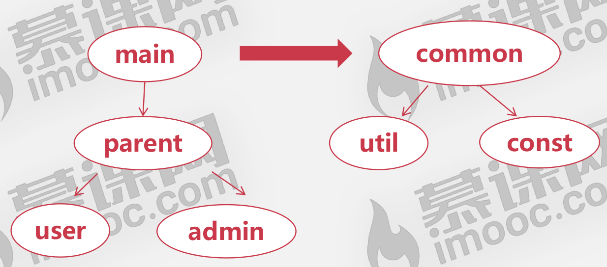

<!--
 * @Description: 
 * @Author: neozhang
 * @Date: 2022-04-06 21:41:19
 * @LastEditors: neozhang
 * @LastEditTime: 2022-04-06 21:44:47
-->
# 抽奖系统  

## 成员介绍  

- 管理员：管理奖池，管理抽奖用户  
- 抽奖用户：参与抽奖，申请抽奖资格  

## 用户文件  

- 用户名  
- 身份： 管理员，抽奖用户  
- 状态： 身份是否有效（申请中，抽奖者，管理员，失效）

## 奖池文件  

- 奖品名  
- 一类等级：1,2,3,4  
- 二类等级：1,2,3  
- 奖品数量  

## 项目架构  

  