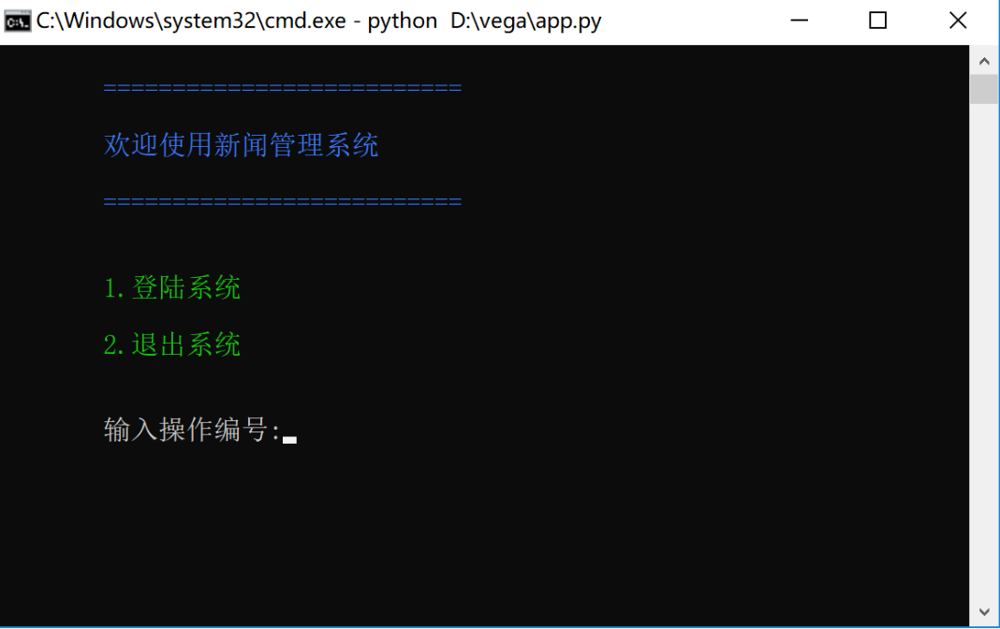
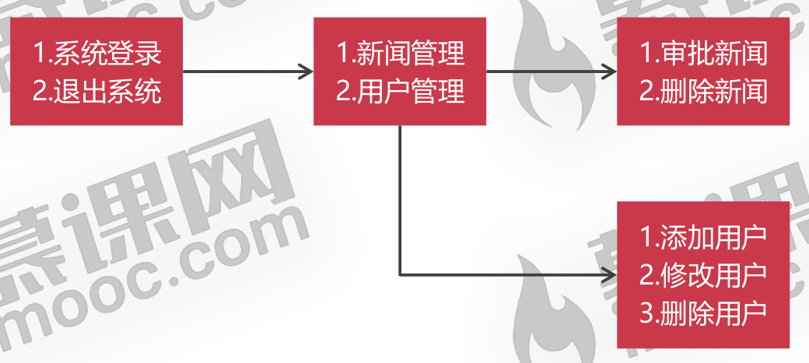

<!--
 * @Description: 
 * @Author: neozhang
 * @Date: 2022-04-06 22:11:42
 * @LastEditors: neozhang
 * @LastEditTime: 2022-04-06 22:19:49
-->
# 新闻管理系统  

项目展示：  

  

安装模块前，先更新pip：  

- 利用pip安装模块之前，必须要先更新pip  
```
python -m pip install --upgrade pip
```

- 如果Python环境安装在C盘，必须用管理员身份打开终端窗口才能升级pip，以及安装模块  

## Colorama模块  

Python程序向控制台输出彩色文字，先要安装colorama模块  

```
pip install colorama

pip install colorama -i
https://pypi.tuna.tsinghua.edu.cn/simple
```

向控制台输出彩色文字  

```py
from colorama import Back,Fore,Style
print(Fore.LIGHTBLUE_EX,"HelloWorld") # 字体颜色
print(Back.LIGHTGREEN_EX,"HelloWorld") # 背景颜色
print(Style.RESET_ALL,"HelloWorld") # 重置
```

## 项目结构  

```
.
├── app.py
├── db
│   ├── __init__.py
│   ├── mysql_db.py
│   ├── news_dao.py
│   ├── role_dao.py
│   └── user_dao.py
├── README.md
├── service
│   ├── __init__.py
│   ├── news_service.py
│   ├── role_service.py
│   └── user_service.py
├── test.py
└── vega.sql
```

## 操作菜单  

管理员身份  

  

## APP程序的作用  

APP程序用来处理控制台的输出和输出的，因为控制台的操作询问是轮询执行的，所以我们需要在APP中使用死循环。  